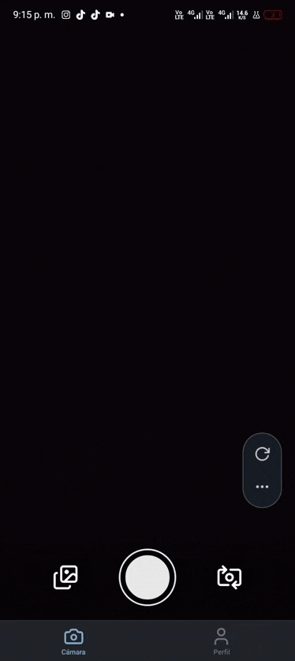

# 🐾 Pawder

> Una aplicación móvil estilo Tinder para capturar y gestionar fotos de mascotas con gestos de swipe

<p align="center">
  
</p>

## 📱 Características

- 📸 **Captura de fotos** con cámara frontal y trasera
- 👆 **Gestos de swipe** estilo Tinder para gestionar fotos
- 💾 **Guardar en galería** deslizando a la derecha
- 🗑️ **Descartar fotos** deslizando a la izquierda
- 🎨 **Interfaz moderna** con animaciones fluidas
- 📊 **Perfil de usuario** con estadísticas
- 🌙 **Tema oscuro** por defecto

## 🎥 Demo


### Funcionalidades principales:

1. **Cámara**: Toma fotos con un toque
2. **Galería**: Revisa tus fotos con gestos intuitivos
3. **Swipe**: Desliza derecha para guardar, izquierda para descartar
4. **Perfil**: Ve tus estadísticas y preferencias

## 🛠️ Tecnologías

- **[React Native](https://reactnative.dev/)** - Framework móvil multiplataforma
- **[Expo](https://expo.dev/)** - Plataforma de desarrollo
- **[TypeScript](https://www.typescriptlang.org/)** - Tipado estático
- **[NativeWind](https://www.nativewind.dev/)** - Tailwind CSS para React Native
- **[Reanimated](https://docs.swmansion.com/react-native-reanimated/)** - Animaciones de alto rendimiento
- **[Expo Camera](https://docs.expo.dev/versions/latest/sdk/camera/)** - API de cámara
- **[Expo Haptics](https://docs.expo.dev/versions/latest/sdk/haptics/)** - Feedback táctil
- **[Lucide Icons](https://lucide.dev/)** - Iconos modernos

## 📋 Requisitos previos

- Node.js 18 o superior
- npm o yarn
- Expo Go app (para testing en dispositivo físico)
- Android Studio (para emulador Android) o Xcode (para iOS)

## 🚀 Instalación

1. **Clona el repositorio**
```bash
git clone https://github.com/tu-usuario/pawder.git
cd pawder
```

2. **Instala las dependencias**
```bash
npm install
```

3. **Inicia el proyecto**
```bash
npm start
```

4. **Ejecuta en tu dispositivo**

   - **Android**: Escanea el QR con Expo Go o ejecuta:
     ```bash
     npm run android
     ```
   
   - **iOS**: Escanea el QR con la cámara o ejecuta:
     ```bash
     npm run ios
     ```

## 📂 Estructura del proyecto

```
pawder/
├── app/                      # Rutas de la aplicación
│   ├── (tabs)/              # Navegación por tabs
│   │   ├── _layout.tsx      # Layout de tabs
│   │   ├── index.tsx        # Pantalla principal (cámara)
│   │   └── profile.tsx      # Pantalla de perfil
│   ├── _layout.tsx          # Layout raíz
│   └── gallery.tsx          # Pantalla de galería
├── components/              # Componentes reutilizables
│   ├── atoms/              # Componentes básicos
│   │   ├── Button.tsx
│   │   └── IconButton.tsx
│   ├── molecules/          # Componentes compuestos
│   │   ├── CameraControl.tsx
│   │   └── PhotoCard.tsx
│   └── organisms/          # Componentes complejos
│       ├── CameraView.tsx
│       └── GalleryView.tsx
├── lib/                     # Lógica de negocio
│   ├── CameraContext.tsx   # Estado global de cámara
│   ├── camera.ts           # Lógica de cámara
│   ├── swipe.ts           # Lógica de gestos
│   └── store.ts           # Store (Zustand)
├── assets/                  # Recursos estáticos
├── app.json                # Configuración de Expo
├── package.json            # Dependencias
└── README.md              # Este archivo
```

## 🎨 Arquitectura

El proyecto sigue una arquitectura **Atomic Design** con componentes organizados en:

- **Atoms**: Componentes básicos reutilizables (botones, iconos)
- **Molecules**: Combinación de atoms (controles de cámara)
- **Organisms**: Componentes complejos (vista de cámara, galería)

### Estado Global

Utilizamos **React Context** para manejar el estado de la cámara y las fotos de forma compartida entre componentes.

### Gestos

Las animaciones de swipe están implementadas con **React Native Reanimated** y **React Native Gesture Handler** para lograr 60fps.

## 🎯 Cómo usar la app

### 1. Pantalla de Cámara
- Toca el botón blanco central para tomar una foto
- Toca el icono de rotación para cambiar entre cámara frontal/trasera
- Toca el icono de galería para ver tus fotos

### 2. Pantalla de Galería
- **Desliza a la derecha** (→) para guardar la foto en tu galería
- **Desliza a la izquierda** (←) para descartar la foto
- Los sellos "LIKE" y "NOPE" aparecen al deslizar

### 3. Pantalla de Perfil
- Ve tus estadísticas (likes, matches, adoptados)
- Configura tus preferencias
- Accede a la configuración de la app

## 🔧 Scripts disponibles

```bash
# Iniciar el servidor de desarrollo
npm start

# Ejecutar en Android
npm run android

# Ejecutar en iOS
npm run ios

# Ejecutar en web
npm run web

# Linter
npm run lint

# Resetear el proyecto
npm run reset-project
```

## 🐛 Troubleshooting

### La cámara no funciona
1. Verifica que los permisos estén concedidos
2. Reinicia la app
3. Limpia el caché: `expo start -c`

### Pantalla negra en la cámara
- Desinstala la app y vuelve a instalarla
- Verifica los permisos en Configuración del dispositivo

### Errores de dependencias
```bash
rm -rf node_modules
npm install
```

## 📝 Licencia

Este proyecto está bajo la licencia MIT. Ver el archivo [LICENSE](LICENSE) para más detalles.

## 👥 Contribuciones

Las contribuciones son bienvenidas. Por favor:

1. Fork el proyecto
2. Crea una rama para tu feature (`git checkout -b feature/AmazingFeature`)
3. Commit tus cambios (`git commit -m 'Add some AmazingFeature'`)
4. Push a la rama (`git push origin feature/AmazingFeature`)
5. Abre un Pull Request

## 📧 Contacto

- GitHub: [@tu-usuario](https://github.com/tu-usuario)
- Email: tu-email@ejemplo.com

## 🙏 Agradecimientos

- [Expo](https://expo.dev/) por la increíble plataforma
- [NativeWind](https://www.nativewind.dev/) por hacer Tailwind posible en React Native
- La comunidad de React Native por su apoyo constante

---

<p align="center">Hecho con ❤️ para mascotas</p>
